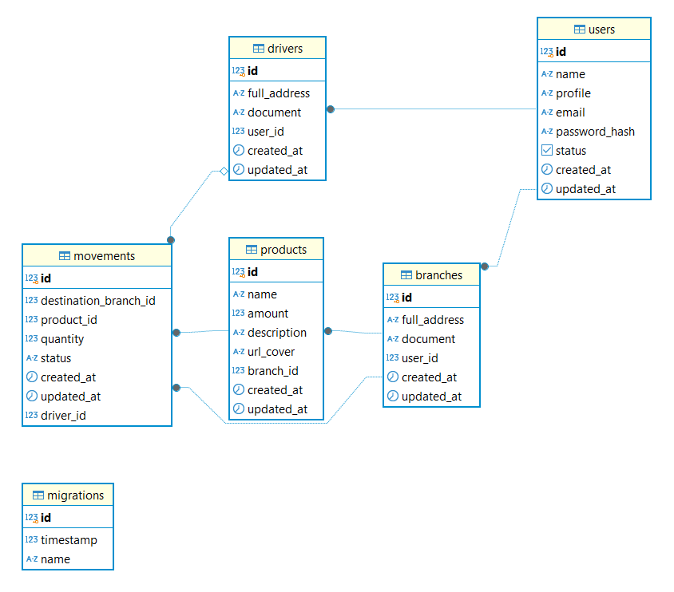

# SupplyTrack - Backend

This is a backend project developed using TypeScript, TypeORM and Express, with Visual Studio Code (VSC) as the development environment. The database used is PostgreSQL, and Postman is employed for route testing.

# Purpose

The backend of this project is designed to manage business logic, user authentication, request processing, and database interaction. Its main functionalities include:

- Processing requests – Receives data from the frontend, processes it, and returns responses.
- Database management – Inserts, queries, updates, and deletes information.
- Authentication and security – Ensures that only authorized users can access certain information.
- Executing business rules – Applies necessary rules and calculations for the application's functionality.
- Integration with APIs and external services – Connects to other platforms, such as payment gateways and third-party services.

In this project, the backend operates exclusively with the database, being responsible for:

- Managing business rules;
- User authentication;
- Database management;
- Request processing.

# Development

## User Types

The system has three types of users:

- ADMIN - System administrator;
- BRANCH - Store branch;
- DRIVER - Driver responsible for delivering products between branches according to stock availability.
  

## Database Structure

Migrations were created for the following tables (entities) and their relationships:

- Branch
- Driver
- Movement
- Product
- User

## API Routes

Using Express Router, the following routes were defined:

1. authRouter
- POST /login - User login (ADMIN, BRANCH, and DRIVER).

2. userRouter (Accessible only to ADMIN)
- POST /users - Create a new user.
- GET /users - List all users.
- GET /users/:id - Get a user by ID.
- PUT /users/:id - Update user data.
- PATCH /users/:id/status - Update user status.

3. movementRouter
- POST /movements - Create a movement (Accessible only to BRANCH).
- GET /movements - List all movements (Accessible only to BRANCH and DRIVER).
- PATCH /movements/:id/start - Start a movement (Accessible only to DRIVER).
- PATCH /movements/:id/finish - Complete a movement (Accessible only to DRIVER).

4. productRouter
POST /products - Create a product (Accessible only to BRANCH).
GET /products - List all products (Accessible only to BRANCH).

## Middleware

The middleware built was used as a token constructor and for its verification in all routes.

## Database

## Technologies Used

- Node.js 
- Express.js
- TypeORM
- PostgreSQL
- JWT (JSON Web Token) for authentication
- Postman (for route testing)
- Visual Studio Code (VSC) as the IDE

## How to Run the Project

1. Configure the Database
- Make sure you have PostgreSQL installed and configured. Create a database for the application.

1. Install Dependencies
- Run the following command in the project root:

npm install

3. Configure Environment Variables

Create the .env File in the project root, create a .env file and add the database configuration:

- DB_HOST=localhost
- DB_PORT=5432
- DB_USER=your_username
- DB_PASSWORD=your_password
- DB_NAME=database_name
- JWT_SECRET=your_jwt_secret

4. Run Migrations

To create the tables in the database, run the following command:

npm run typeorm migration:run

1. Start the Server
   
Start the application with:

npm start

The API will be available at http://localhost:3000.

## Conclusion

This backend project was developed to meet the needs of a system that manages product logistics between branches, ensuring inventory control, movement, and secure user authentication. By using modern technologies like Node.js, Express, TypeORM, and PostgreSQL, we were able to structure an efficient, secure, and scalable API. Future improvements may include integration with new external services, optimization of database queries, and implementation of automated tests to ensure greater system stability.

